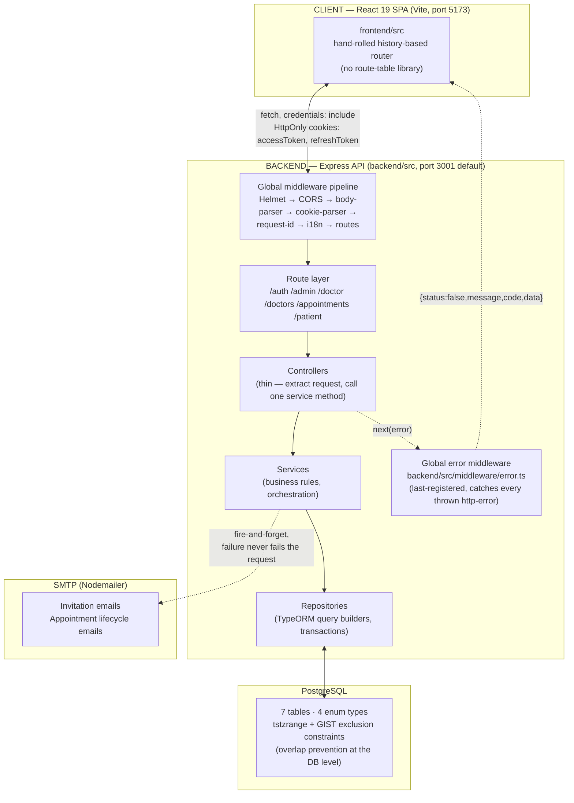
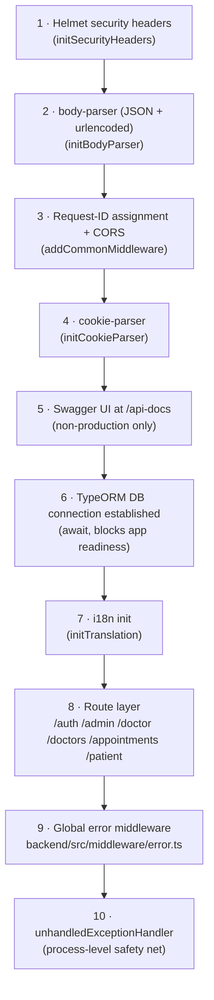
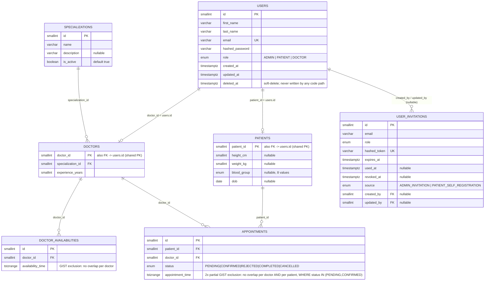

# 00 — System Overview

## Architecture

A single Express (TypeScript) API, a React SPA served by a separate Vite dev server, PostgreSQL, and outbound SMTP. No queue, no microservices, no server-side session store — sessions are two stateless JWTs carried in HttpOnly cookies.

Frontend and backend run as **separate origins** in development — the frontend dev server proxies nothing to the backend by default path structure (backend routes are mounted at root, e.g. `/auth/login`, not `/api/auth/login`); CORS is configured backend-side via `FRONTEND_URL` with `credentials: true`. The backend never serves the frontend's built assets (no `express.static`/`sendFile` anywhere in `backend/src`).

## Middleware pipeline (exact registration order)

From `backend/src/app.ts` → `backend/src/core/kernel.ts`, in the order every request actually passes through:

Per-route middleware (rate limiter → `authenticate` → `authorize` → Joi `validate`) is layered on top of this global pipeline, at step 9, and differs per route — see docs 01–04 and 09.

## Route mount map

`backend/src/api/route/index.ts` is the single source of truth for base paths:

| Base path | Router file | Who can call it |
|---|---|---|
| `/auth` | `auth.routes.ts` | Public — no route on this router uses `authenticate`/`authorize` |
| `/admin` | `admin.routes.ts` | ADMIN only, on every route |
| `/doctor` | `doctor.routes.ts` (`DoctorRoute`) | DOCTOR only, on every route |
| `/doctors` | `doctor.routes.ts` (`DoctorsDiscoveryRoute`) | Mixed — one public route, two requiring PATIENT/DOCTOR/ADMIN |
| `/appointments` | `appointment.route.ts` | PATIENT only, on every route |
| `/patient` | `patient.routes.ts` | PATIENT only, on every route |
| `/` | inline in `index.ts` | Public health check — `{ success: true, data: { status: "ok" } }` |

Doctor-side appointment actions (`GET /doctor/appointments`, `PATCH /doctor/appointments/:id/status`) live under `/doctor`, not `/appointments` — the `/appointments` router is patient-only.

## Database schema (entity-relationship)

7 tables, all under `SnakeNamingStrategy` (camelCase entity fields ↔ snake_case columns). `doctors`/`patients` share their primary key with `users.id` (table-per-role-profile pattern, not a generic profile table).

A hand-drawn ER image also exists at [`docs/images/database-schema.png`](../images/database-schema.png) (pre-dates the booking-abuse-limit and invitation-source additions — the Mermaid diagram above is the current source of truth).

**Constraints enforced entirely at the Postgres level** (not in application code — the service layer only catches the resulting error code and translates it to an HTTP response):

| Constraint | Table | Effect |
|---|---|---|
| `doctor_availability_no_overlap` (GIST exclusion) | `doctor_availabilities` | A doctor cannot have two overlapping availability windows. Violation → Postgres `23P01` → service throws 409 `AVAILABILITY_OVERLAP`. |
| `appointments_no_doctor_overlap` (partial GIST exclusion, `WHERE status IN ('PENDING','CONFIRMED')`) | `appointments` | A doctor cannot have two overlapping active appointments. Violation → `23P01` → 409 `APPOINTMENT_TIME_UNAVAILABLE`. |
| `appointments_no_patient_overlap` (partial GIST exclusion, same WHERE) | `appointments` | A patient cannot have two overlapping active appointments **even with different doctors**. Same violation/response as above. |
| `idx_user_invitations_active_email` (partial unique index, `WHERE used_at IS NULL AND revoked_at IS NULL`) | `user_invitations` | At most one *active* invitation per email. Violation → Postgres `23505` → service retries once if the conflicting row is merely expired, else 409 `INVITATION_ALREADY_SENT`. |
| `hashed_token` unique | `user_invitations` | Belt-and-braces uniqueness on the token hash itself. |
| `email` unique | `users` | One account per email address. |

Indexes added purely for query performance (no behavioral effect): `idx_appointments_patient_id_status`, `idx_appointments_doctor_id_status`, and a GIST index on `appointments.appointment_time` (migration `20260827120000-AddAppointmentQueryIndexes`).

## Role capability summary

| Capability | Patient | Doctor | Admin |
|---|:---:|:---:|:---:|
| Self-register / accept invitation | ✅ (self-register) | ✅ (invitation only) | ✅ (invitation only) |
| Log in / refresh / log out | ✅ | ✅ | ✅ |
| View/update own profile | ✅ (height, weight) | ✅ (experience years only) | — (no profile endpoint) |
| Browse/search/filter doctors | ✅ | ✅ (same shared endpoint) | ✅ (same shared endpoint) |
| View a doctor's free slots | ✅ | ✅ | ✅ |
| Create/view own availability | — | ✅ | — |
| Delete availability | — | ❌ (service method exists, no route) | — |
| Book an appointment | ✅ | — | — |
| View own appointments | ✅ | ✅ (their own, as the doctor) | — |
| Cancel an appointment | ✅ (own, PENDING/CONFIRMED, future only) | — | — |
| Confirm / reject a request | — | ✅ (own, PENDING only) | — |
| Complete an appointment | — | ✅ (own, CONFIRMED + already started) | — |
| Invite a user | — | — | ✅ (DOCTOR/ADMIN only, not PATIENT) |
| Bulk-invite via CSV | — | — | ✅ (DOCTOR/ADMIN rows only) |
| List/filter/revoke invitations | — | — | ✅ |
| Manage (view/edit/deactivate) doctor or patient accounts | ❌ — does not exist | ❌ — does not exist | ❌ — does not exist |

See [00 → Documented gaps](./README.md#documented-gaps-and-inconsistencies) for the full list of things that were checked for and confirmed absent.
