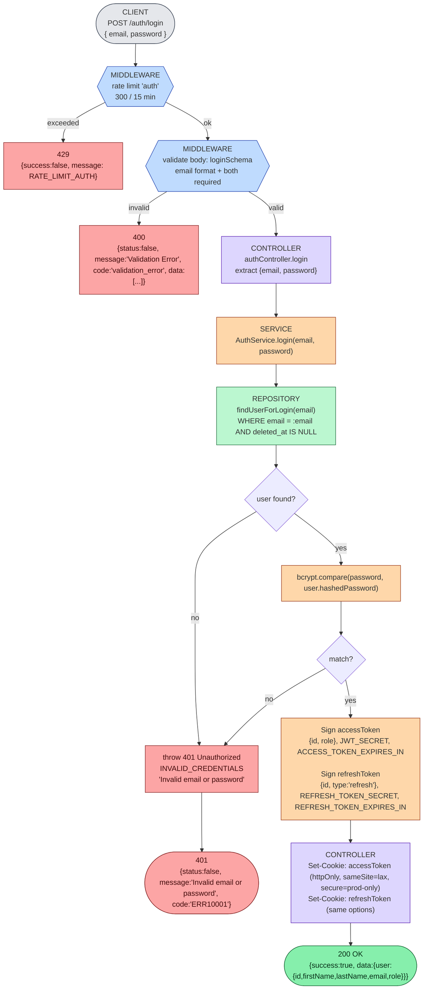
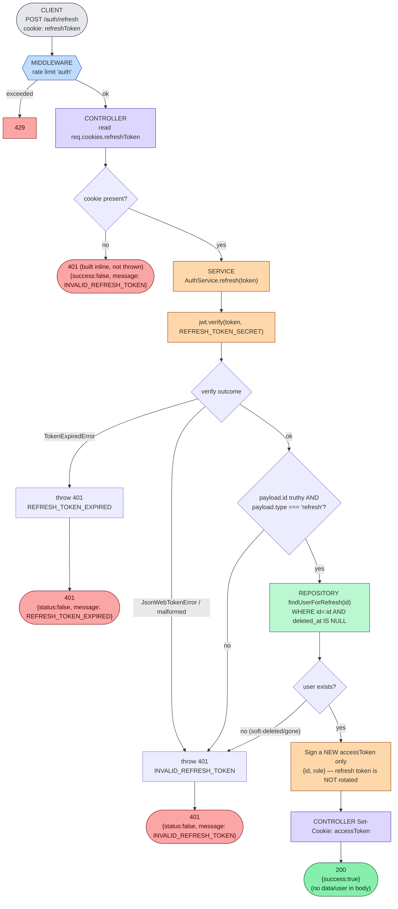
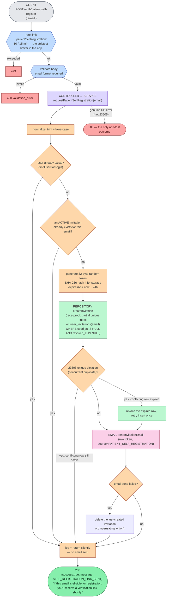
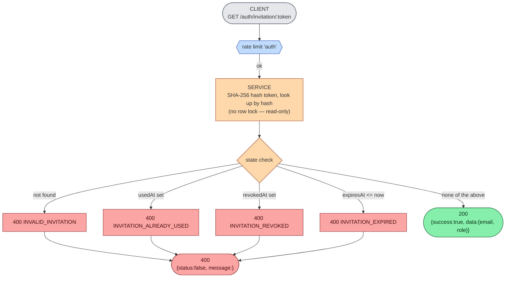
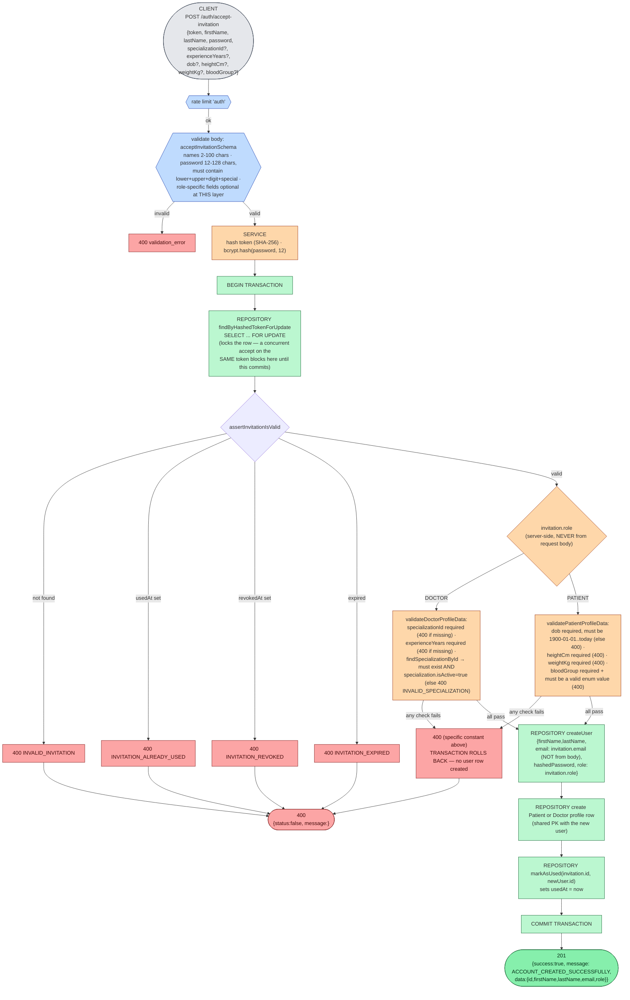
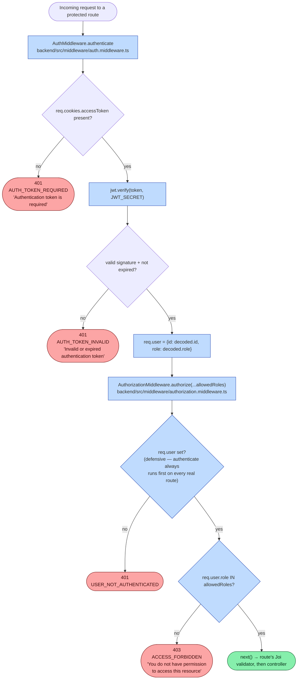

# 01 — Authentication & Authorization

Every route in this file group (`/auth/*`) is **public** — none of them use `AuthMiddleware.authenticate` or `AuthorizationMiddleware.authorize`. This is the only router in the app where that's true.

Session state is two JWTs (`HS256`, default algorithm, no `algorithms` restriction passed to `jwt.verify`), signed with `JWT_SECRET`/`REFRESH_TOKEN_SECRET`, carried as **HttpOnly cookies** (`accessToken`, `refreshToken`) — never returned in a JSON body. There is no server-side session store or refresh-token blocklist; validity is purely signature + expiry + (for refresh) `type: "refresh"` in the payload + the user still existing (not soft-deleted).

## What does NOT exist here

Confirmed absent by exhaustive grep, not assumed:
- **No password-reset / forgot-password flow** — no route, controller, service method, or validator anywhere in `backend/src` or `frontend/src`.
- **No email-verification flow separate from invitation acceptance.** The self-registration page's "Verify Email" button is UI copy on top of the same invitation-token mechanism described below — there is no `emailVerifiedAt` column and no standalone verify endpoint.
- **No account-status / active flag beyond soft-delete.** `AuthRepository.findUserForLogin`/`findUserForRefresh` both filter `deleted_at IS NULL`; there is no separate `isActive` check, and nothing in the codebase ever sets `deletedAt` on a `User`.

## Password rules

| Context | Rule | Enforced by |
|---|---|---|
| Login (`POST /auth/login`) | Non-empty string only — no complexity check | `loginSchema` (Joi) |
| Account creation (`POST /auth/accept-invitation`) | 12–128 chars; must contain lowercase, uppercase, a digit, and a special character | `acceptInvitationSchema` (Joi) |
| Hashing | `bcrypt`, cost factor **12** | `AuthService.acceptInvitation` |
| Verification | `bcrypt.compare` | `AuthService.login` |

## 1. `POST /auth/login`

The response deliberately gives **identical** `INVALID_CREDENTIALS` for "no such user" and "wrong password" — no user-enumeration signal.

## 2. `POST /auth/refresh`

Reads the refresh token from the `refreshToken` HttpOnly cookie only — no body, no validator on this route.

**Frontend usage** (`frontend/src/api/apiClient.ts`): `apiFetch` automatically calls this endpoint once, silently, on any `401` from any other endpoint, then retries the original request. If the refresh itself fails, it clears `localStorage`, best-effort calls `/auth/logout`, and dispatches a `docpulse:session-expired` event that `AuthContext` listens for to drop the client-side user state — this is how `e2e/tests/auth-failure-paths.spec.ts`'s "cleared cookies mid-session" test ends up back at the login screen without an explicit logout click.

## 3. `POST /auth/logout`

No service call, no DB access, no auth required. Clears both cookies (matching `httpOnly`/`secure`/`sameSite`/`path`, no `maxAge` needed) and always returns `200 {success:true}`. (`req.user` is logged for an audit line but is always `undefined` here since this route has no `authenticate` middleware.)

## 4. `POST /auth/patient/self-register`

Enumeration-safe by design: **every** outcome except a genuine infrastructure failure returns the same `200`.

The frontend (`PatientSelfRegisterPage.tsx`) is written to match this contract exactly: it always shows a "Check Your Inbox" confirmation regardless of whether the email was new, already-registered, or mid-invitation (verified by `e2e/tests/patient-self-register.spec.ts`, test 3).

## 5. `GET /auth/invitation/:token`

Public, read-only preview — does **not** consume the invitation (no `usedAt` write). Used by `AcceptInvitationPage` on mount to resolve the invited role/email before rendering the right form fields.

## 6. `POST /auth/accept-invitation` — the most involved auth endpoint

This is the **only** transaction in the auth domain, and the only place a row lock is taken outside the appointment/availability exclusion constraints.

**Concurrency guarantee** (verified by `invitation.test.ts`, "two concurrent accept-invitation calls with the same token"): the `SELECT ... FOR UPDATE` means the second concurrent request for the same token blocks until the first commits, then re-reads the row and sees `usedAt` already set → 400, not a duplicate user. **Any failure inside the transaction rolls back everything** — a bad `specializationId` leaves no `users` row and the invitation's `usedAt` stays `NULL`, so the same token can be retried successfully afterward (verified by the same test file).

## Authorization architecture (used by every other protected route)

Two independent, composable middlewares — every protected route in the app (everything except `/auth/*` and `GET /doctors/specializations`) uses both, in this order:

**Authentication vs. authorization vs. resource ownership — three distinct, separately-enforced concerns in this codebase:**

| Concern | Where enforced | Failure |
|---|---|---|
| **Authentication** — "is there a valid session at all?" | `AuthMiddleware.authenticate`, every protected route | 401 |
| **Authorization (role)** — "is this role allowed to hit this route at all?" | `AuthorizationMiddleware.authorize(...)`, every protected route | 403 |
| **Resource ownership** — "does this specific resource belong to this specific user?" | **Not middleware** — enforced inside repository queries by scoping `WHERE`, e.g. `findDoctorAppointmentById(id, doctorId)`, `findPatientAppointmentById(id, patientId)`, `deleteAvailability({id, doctorId})`. A mismatch surfaces as a **404** ("not found"), not a 403, because the row is fetched *with* the ownership filter already applied — the API never confirms the resource exists before checking ownership, so a request for someone else's resource looks identical to a request for a non-existent one. |

There is no separate "resource ownership" middleware layer anywhere in the app — every ownership check documented in docs 02/03 is a `WHERE ... AND {ownerId} = :callerId` clause inside the relevant repository method.

## Rate limiters (full map)

All four `express-rate-limit` instances share a 15-minute window and are fully **disabled when `NODE_ENV=test`** (`skipInTestEnv()`); every one keys by IP (no custom `keyGenerator`), and on rejection returns `429` with `{success:false, message:"<limiter message>"}` directly from the library — this bypasses both the controller-authored envelope and the global error middleware entirely.

| Limiter | Max / 15 min | Applied to |
|---|---|---|
| `general` | 1000 | Nearly everything except the four rows below |
| `auth` | 300 | `/auth/login`, `/auth/refresh`, `/auth/accept-invitation`, `/auth/invitation/:token`, `/auth/logout` |
| `invitation` | 500 | `/admin/invite`, `/admin/invitations/bulk` |
| `patientSelfRegistration` | **10** | `/auth/patient/self-register` only — the strictest limiter in the app, on the one fully-public, unauthenticated write endpoint |
