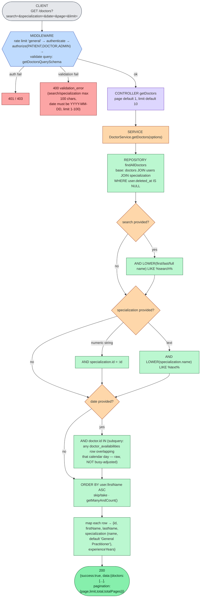
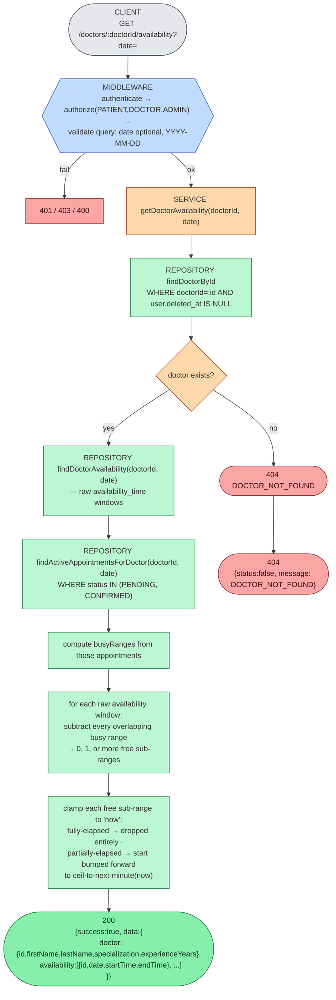
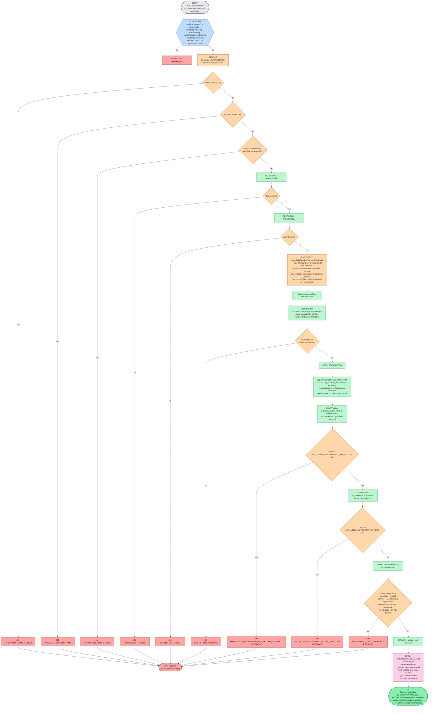
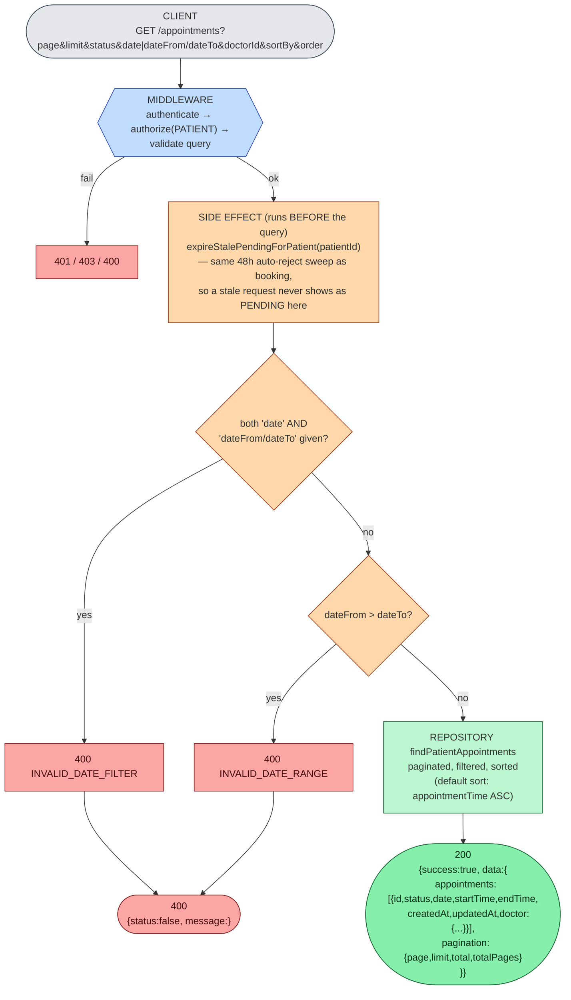
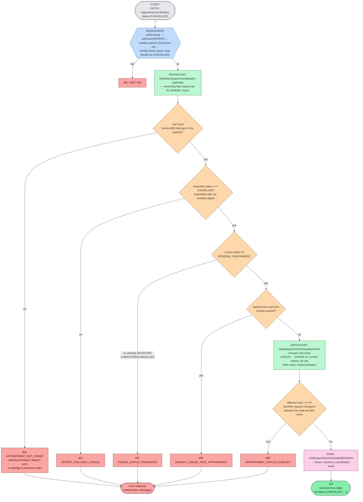
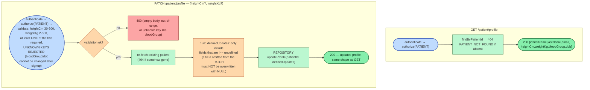

# 02 — Patient Flows

Every route below except `GET /doctors/specializations` requires `authenticate` + `authorize(PATIENT)` (for `/doctors` discovery routes: `authorize(PATIENT, DOCTOR, ADMIN)` — they're shared, not patient-exclusive). See [doc 01](./01-authentication-authorization.md) for the shared middleware mechanics and [doc 05](./05-appointment-lifecycle.md) for the full appointment state machine.

## 1. Browse / search / filter doctors — `GET /doctors`

A genuine server-side search with three simultaneous, independent filters (confirmed against `PatientDoctorDiscovery.tsx`'s actual rendered controls: a name-search text box, a specialization `<select>`, and a native date picker) plus pagination — not a static list.

An empty result set is **not an error** — 200 with `doctors: []` and `total: 0`.

## 2. View a doctor's free slots — `GET /doctors/:doctorId/availability`

This is a **read-model preview**, not a reservation — it does not lock or hold anything. The actual non-overlap guarantee is enforced later, at booking time, by the database (see step 4 and [doc 06](./06-availability-lifecycle.md)).

`CANCELLED`, `REJECTED`, and `COMPLETED` appointments are **not** treated as busy — only `PENDING`/`CONFIRMED` subtract from availability. A slot freed by a cancellation reappears here immediately (verified by `doctor-availability-query.test.ts`).

## 3. View specializations — `GET /doctors/specializations`

The **only** unauthenticated resource endpoint in the app (deliberately — the not-yet-registered accept-invitation page needs it). `rate limit 'general'` only, no `authenticate`/`authorize`. Returns `{success:true, data:[{id,name,description}]}` for every `Specialization` row where `isActive = true`, ordered by name. No error path beyond the rate limiter.

## 4. Book an appointment — `POST /appointments`

The most involved endpoint in the whole system: 3 pre-checks, 2 existence checks, a side-effect sweep, an availability check, then a **database transaction** holding a Postgres advisory lock while two abuse-prevention caps are evaluated, guarded on the outside by a DB exclusion constraint. See [doc 05](./05-appointment-lifecycle.md#booking-abuse-limits) for why the caps exist and how the lock makes them race-safe.

**Why the lock is on `patientId` alone, not `(patientId, doctorId)`**: a plain `SELECT COUNT(*)` inside a transaction cannot see another concurrent transaction's uncommitted insert (READ COMMITTED). Locking on the patient id serializes *every* booking attempt by that one patient — sufficient to make both cap checks race-safe, since the patient is the only actor who could jointly violate their own caps. See `backend/src/database/repository/appointment.repository.ts` (`acquirePatientBookingLock`) and [doc 05](./05-appointment-lifecycle.md#booking-abuse-limits) for the full reasoning.

**Known frontend bug** (not a backend issue): `AppointmentBookingModal`'s own in-modal "Appointment requested successfully!" message is almost never visible — `onSuccess()` runs synchronously right after `setSuccessMsg(...)`, which switches `DashboardPage`'s active tab and unmounts the modal before the message can render. The booking itself succeeds; only the transient success toast inside the modal is effectively dead code. Documented in `e2e/tests/patient-booking.spec.ts` (lines 107-121), which instead asserts the new appointment shows up under "My Appointments" as "Pending Approval".

## 5. View own appointments — `GET /appointments`

## 6. Cancel an appointment — `PATCH /appointments/:appointmentId/status`

The patient-facing status endpoint accepts **exactly one** target status: `CANCELLED` — enforced twice, once by the Joi schema (`patientAppointmentStatusBodySchema` only allows the literal `"CANCELLED"`) and again inside the service.

## 7. View / update profile — `GET` / `PATCH /patient/profile`

`dob` and `bloodGroup` are permanent after signup — there is no endpoint that can change them (confirmed by `patient.test.ts`'s unknown-key-rejection assertions and `e2e/tests/profile-updates.spec.ts`, which shows them as read-only in the UI).
