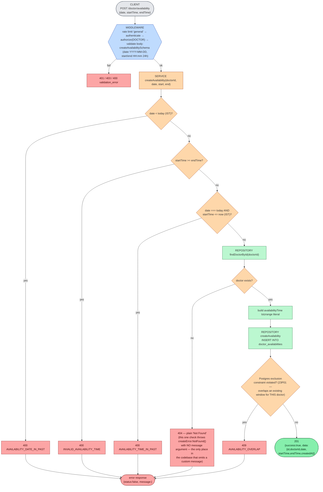
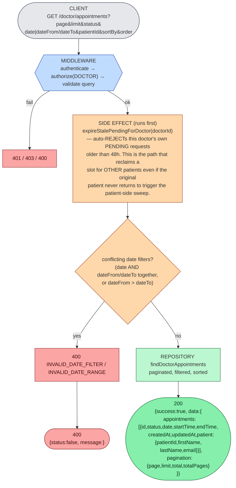
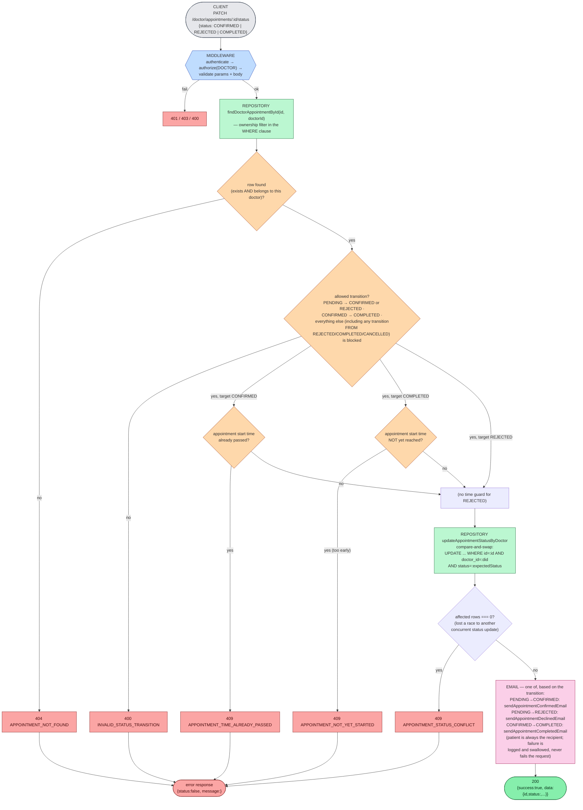
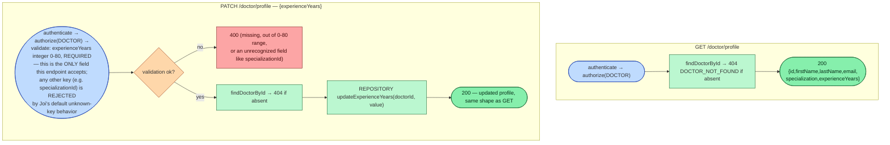

# 03 — Doctor Flows

Every route below is mounted under `/doctor` and requires `authenticate` + `authorize(DOCTOR)`. See [doc 01](./01-authentication-authorization.md) for shared middleware mechanics, [doc 05](./05-appointment-lifecycle.md) for the full appointment state machine, and [doc 06](./06-availability-lifecycle.md) for the availability model in depth.

## 1. Create an availability window — `POST /doctor/availability`

Overlap prevention is entirely a Postgres `GIST` exclusion constraint (`doctor_availability_no_overlap`) — there is no application-level "does this overlap?" query; the service only catches the resulting `23P01`.

## 2. View own availability — `GET /doctor/availability`

`authenticate → authorize(DOCTOR) → validate query (date optional)` → `DoctorService.getOwnAvailability(doctorId, date?)` → 404 `DOCTOR_NOT_FOUND` if the doctor record is somehow gone, else `findDoctorAvailability` (optionally filtered to one calendar day) → `200 {success:true, data:[{id,date,startTime,endTime}, ...]}`. **This is the raw list — unlike the patient-facing `GET /doctors/:id/availability`, it is not busy-adjusted** (a doctor sees their full published windows here, including ones already booked out; confirmed by `doctor-availability-query.test.ts`).

## 3. View own appointments — `GET /doctor/appointments`

Note the doctor-side response nests `patient` (with `email`), whereas the patient-side listing nests `doctor` (without `email`) — an intentional asymmetry, not an inconsistency to "fix".

## 4. Confirm / reject / complete an appointment — `PATCH /doctor/appointments/:appointmentId/status`

The doctor-facing status endpoint accepts exactly `CONFIRMED`, `REJECTED`, or `COMPLETED` (`doctorAppointmentStatusBodySchema`) — a doctor can **never** set `CANCELLED` (that's patient-only) or `PENDING`.

See [doc 05](./05-appointment-lifecycle.md) for the complete transition table including the patient-side `CANCELLED` path and the system-driven stale-`PENDING` auto-expiry.

## 5. View / update profile — `GET` / `PATCH /doctor/profile`

Specialization is **permanent after signup** — there is no endpoint, for the doctor or for an admin, that can change it (verified by `doctor.test.ts`: sending `specializationId` in the PATCH is rejected, and a follow-up GET confirms the specialization is unchanged).

## Availability deletion — does not exist as an API

`DoctorService.deleteAvailability(availabilityId, doctorId)` and `DoctorRepository.deleteAvailability` are fully implemented (ownership-scoped delete, 404 `AVAILABILITY_NOT_FOUND` if the row doesn't exist or belongs to another doctor) — **but no route or controller ever calls them.** A doctor has no way to remove a published availability window via the API today. See [doc 06](./06-availability-lifecycle.md#deletion--implemented-but-unreachable) for the full detail.
