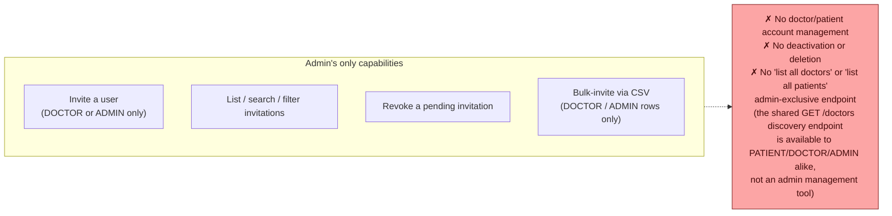
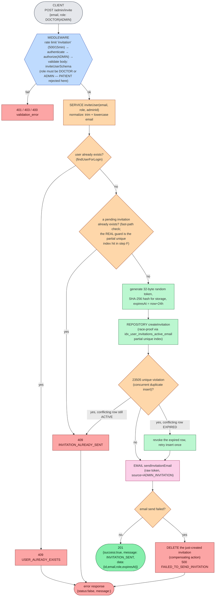
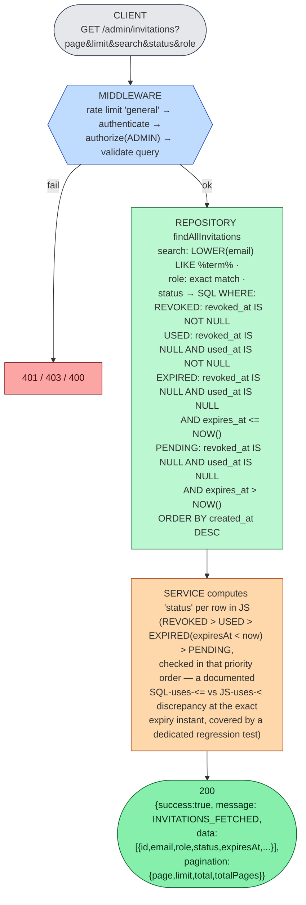
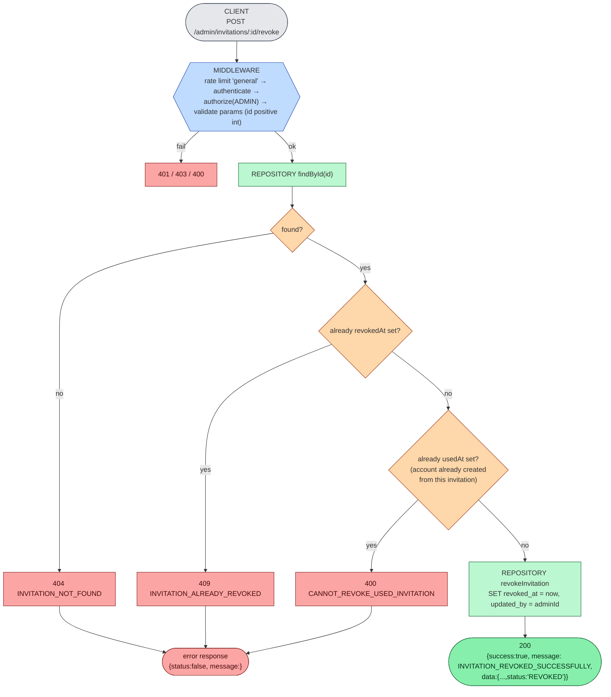
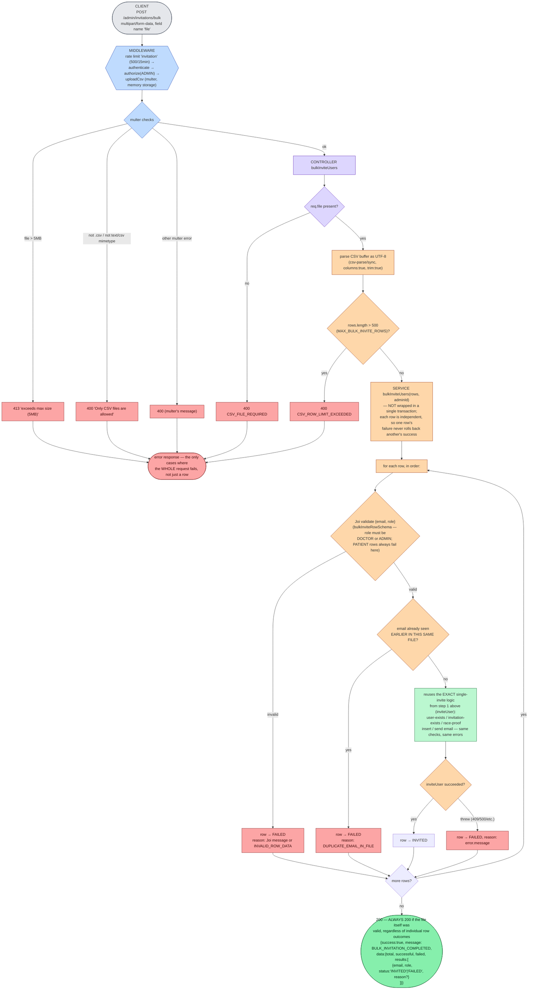
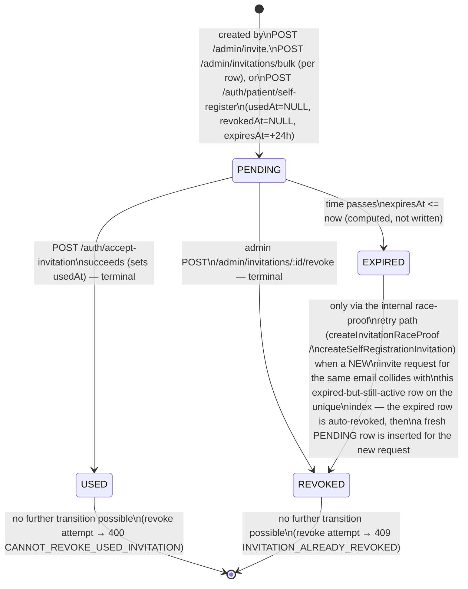

# 04 — Admin Flows

Every route below is mounted under `/admin` and requires `authenticate` + `authorize(ADMIN)`. **The admin domain's entire capability surface is invitation management — nothing else.** Confirmed by exhaustive grep (`deactivat|suspend|isActive|deletedAt`) across the backend: there is no admin endpoint to list, view, edit, deactivate, suspend, or delete an existing doctor or patient account. The `User.deletedAt` soft-delete column exists but no code path ever writes to it. The admin frontend (`AdminLayout.tsx`) has exactly one sidebar item: "Invitations".

**PATIENT accounts can never be admin-invited** — `inviteUserSchema` and `bulkInviteRowSchema` both restrict `role` to `ADMIN`/`DOCTOR` only. Patients exist solely via `POST /auth/patient/self-register` ([doc 01](./01-authentication-authorization.md#4-post-authpatientself-register)).

## 1. Invite a single user — `POST /admin/invite`

This is **not wrapped in a database transaction** — each step (existence check, invitation check, insert, email) is a separate operation, unlike `AuthService.acceptInvitation`. The race-safety comes entirely from the partial unique index + the `23505` catch-and-retry, not from an explicit transaction boundary.

## 2. List / search / filter invitations — `GET /admin/invitations`

## 3. Revoke an invitation — `POST /admin/invitations/:id/revoke`

A revoked invitation cannot itself be un-revoked, and cannot transition to any other state — see [invitation state machine](#invitation-state-machine) below.

## 4. Bulk-invite via CSV — `POST /admin/invitations/bulk`

The one route with **no Joi body validator** — row-level validation happens inside the service, and the CSV/file handling happens in dedicated multer middleware.

Important distinction this diagram makes explicit: a **whole-request failure** (bad file, too many rows, no file) is a non-200 HTTP response; a **per-row failure** (bad email, duplicate, already invited) is still inside a `200` response, surfaced only in `data.results[i].status === "FAILED"`. The e2e test (`admin-bulk-invite.spec.ts`) exercises exactly this: a 2-row CSV with one good row and one bad row returns `200` with "Successful (1)" / "Failed (1)".

## Invitation state machine

`UserInvitation` has no `status` column — status is **computed live** from three nullable timestamp columns, identically (modulo the `<` vs `<=` boundary noted above) in both the SQL query (`InvitationRepository.findAllInvitations`) and the JS mapper (`AdminService.getAllInvitations`).

`source` (`ADMIN_INVITATION` vs `PATIENT_SELF_REGISTRATION`) only records provenance — both sources feed the identical state machine and the identical `POST /auth/accept-invitation` acceptance endpoint.
