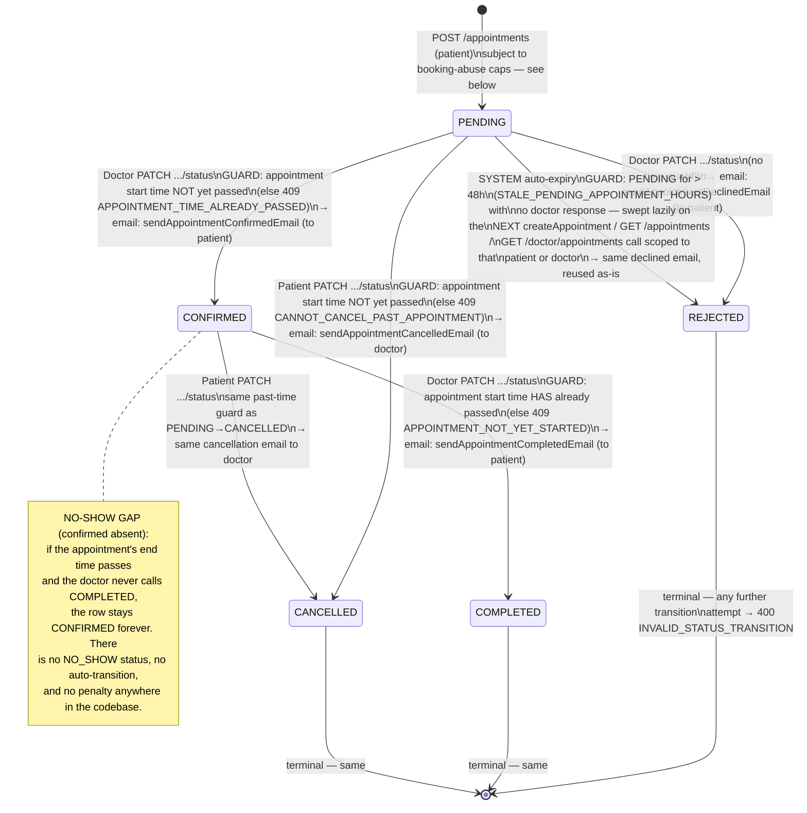
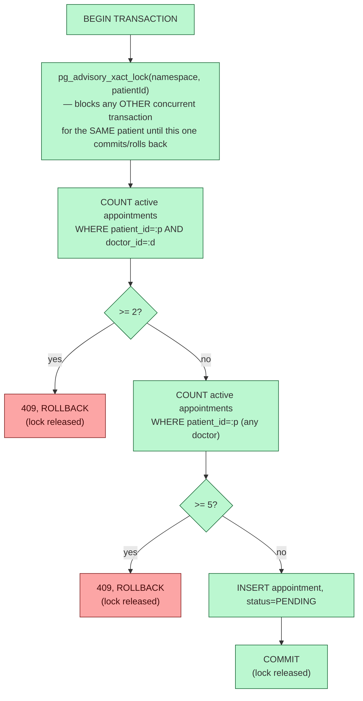

# 05 — Appointment Lifecycle

`Appointment.status` (`backend/src/database/enum/AppointmentStatus.ts`): `PENDING | CONFIRMED | REJECTED | COMPLETED | CANCELLED`. All logic lives in `AppointmentService` (`backend/src/service/appointment.service.ts`) — there is no database trigger or stored procedure driving transitions (only the two GIST exclusion constraints are DB-level, and those prevent *creation* of a conflicting row, not a status transition).

## Full state machine



## Every guard condition, explicitly

| Transition | Actor | Endpoint | Guard | Failure |
|---|---|---|---|---|
| `— → PENDING` | Patient | `POST /appointments` | Date/time not in the past; doctor & patient exist; doctor availability covers the exact slot; **per-doctor cap** (<2 active); **global cap** (<5 active); no DB exclusion-constraint conflict | 400/404/409 — see [doc 02](./02-patient-flows.md#4-book-an-appointment--post-appointments) |
| `PENDING → CONFIRMED` | Doctor | `PATCH /doctor/appointments/:id/status` | Row belongs to this doctor; current status is `PENDING`; start time **not yet passed** | 404 / 400 `INVALID_STATUS_TRANSITION` / 409 `APPOINTMENT_TIME_ALREADY_PASSED` |
| `PENDING → REJECTED` | Doctor | same | Row belongs to this doctor; current status is `PENDING` (no time guard — a doctor can decline even a past-due request) | 404 / 400 |
| `PENDING → REJECTED` | System | (side effect of `createAppointment`, `getPatientAppointments`, `getDoctorAppointments`) | `createdAt` older than 48h and still `PENDING` | n/a — never client-visible as an error, only as a state change the client observes afterward |
| `CONFIRMED → COMPLETED` | Doctor | `PATCH /doctor/appointments/:id/status` | Row belongs to this doctor; current status is `CONFIRMED`; start time **has** already passed | 404 / 400 / 409 `APPOINTMENT_NOT_YET_STARTED` |
| `PENDING → CANCELLED` | Patient | `PATCH /appointments/:id/status` | Row belongs to this patient; status literally `CANCELLED` requested; current status `PENDING` or `CONFIRMED`; start time **not yet passed** | 404 / 400 `PATIENT_CAN_ONLY_CANCEL` / 400 `INVALID_STATUS_TRANSITION` / 409 `CANNOT_CANCEL_PAST_APPOINTMENT` |
| `CONFIRMED → CANCELLED` | Patient | same | same as above | same |
| any transition from `REJECTED`/`COMPLETED`/`CANCELLED` | anyone | either endpoint | blocked unconditionally — these are terminal | 400 `INVALID_STATUS_TRANSITION` |
| Doctor attempts `CANCELLED` | Doctor | doctor endpoint | rejected at the **Joi validator** (`doctorAppointmentStatusBodySchema` only allows `CONFIRMED\|REJECTED\|COMPLETED`) — never reaches the service | 400 validation_error |
| Patient attempts `CONFIRMED`/`REJECTED`/`COMPLETED` | Patient | patient endpoint | rejected at the **Joi validator** (`patientAppointmentStatusBodySchema` only allows the literal `CANCELLED`) | 400 validation_error |

## Concurrency safety — compare-and-swap on every transition

Both `updateAppointmentStatusByDoctor` and `updateAppointmentStatusByPatient` (and `cancelAppointment`'s call into the latter) issue:

```sql
UPDATE appointments SET status = :newStatus
WHERE id = :id AND {doctor_id|patient_id} = :callerId AND status = :expectedStatus
```

If the row's status changed underneath the caller between their read and this write (another concurrent request won the race), `affected = 0` and the service throws `409 APPOINTMENT_STATUS_CONFLICT` rather than silently no-op'ing or overwriting. Verified deterministically in `appointment.test.ts` by mocking a lost race, and non-deterministically by firing two real concurrent HTTP requests at the same row (exactly one ever returns `200`).

## Booking-abuse limits

Added to close a real gap: nothing previously stopped a patient from reserving an unbounded number of future slots, either with one doctor or spread across many.

| Rule | Constant | Default | Counts as "active" |
|---|---|---|---|
| Per-doctor cap | `MAX_ACTIVE_APPOINTMENTS_PER_DOCTOR` | 2 | `status IN (PENDING, CONFIRMED)` AND `upper(appointment_time) > now()`, scoped to `(patientId, doctorId)` |
| Global cap | `MAX_ACTIVE_APPOINTMENTS_TOTAL` | 5 | same status/time filter, scoped to `patientId` across all doctors |

Both are evaluated **inside a single database transaction**, guarded by a Postgres advisory transaction lock keyed on `patientId` (`pg_advisory_xact_lock`), acquired *before* either `COUNT` query runs:



**Why a lock, not a plain count-then-insert**: at Postgres's default READ COMMITTED isolation, two concurrent transactions' `COUNT(*)` queries can't see each other's uncommitted inserts — both could read "1 of 2 used" and both insert, landing at 3. The advisory lock serializes every booking attempt *by that one patient*, which is sufficient (the patient is the only actor who can jointly violate their own cap).

**Why the lock key is the patient, not `(patient, doctor)`**: a global per-patient serialization point also makes the *global* cap check race-safe for free, without a second lock.

**Why an advisory lock and not `SELECT ... FOR UPDATE`** (the pattern used for accepting invitations, [doc 01](./01-authentication-authorization.md#6-post-authaccept-invitation)): `FOR UPDATE` locks a row that already exists. A patient's *first* booking has zero existing appointment rows to lock — Postgres cannot lock the absence of a row. The advisory lock, keyed purely on the numeric patient id, needs no row to exist.

**Why not a Postgres trigger enforcing the count**: it would require a migration and move a tunable business number out of TypeScript into PL/pgSQL, unlike every other rule in this file (date/time validation, transition rules) which lives in the service. The two *existing* DB-level constraints are structural relational invariants ("no two rows may occupy the same slot") — categorically different from "no more than N rows of this shape may exist," which this codebase keeps in application code.

## Stale-PENDING auto-expiry

If a doctor never responds to a request, nothing previously reclaimed that slot. `AppointmentService.expireStalePendingForPatient(patientId)` / `expireStalePendingForDoctor(doctorId)` run a single atomic `UPDATE ... WHERE status='PENDING' AND created_at < cutoff` (cutoff = now − 48h), returning the ids it just flipped to `REJECTED`, then fires the existing "declined" email for each one via the normal `PENDING→REJECTED` notification path — no new email template was needed.

This sweep is triggered **lazily** (there is no cron/scheduler in this codebase) at the start of three call paths:

| Trigger | Scope |
|---|---|
| `POST /appointments` (before the availability/cap checks) | the booking patient's own stale requests, across all doctors |
| `GET /appointments` (before listing) | same — patient-scoped |
| `GET /doctor/appointments` (before listing) | the viewing doctor's own stale requests, across all patients — **this is the only path that reclaims a slot for other patients** if the original patient never comes back |

A `PENDING` row inside the 48h window is untouched by the sweep and still counts fully against both caps above.

## What still doesn't exist (documented gaps, not proposals)

- **No no-show tracking.** A `CONFIRMED` appointment whose time fully elapses with no doctor action stays `CONFIRMED` indefinitely — no auto-transition, no flag, no patient penalty.
- **No cancellation-frequency limit.** A patient can book and cancel the same doctor's slots repeatedly; each cycle still sends its normal request + cancellation emails, bounded only by the generic per-IP rate limiter ([doc 01](./01-authentication-authorization.md#rate-limiters-full-map)).
- **No doctor-rejection-rate monitoring.** Nothing tracks or flags a doctor who rejects an unusual proportion of requests.
