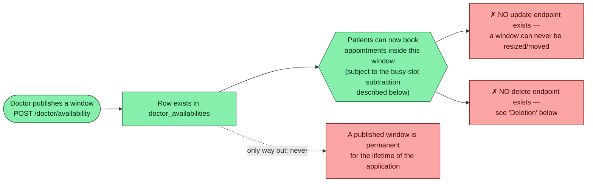
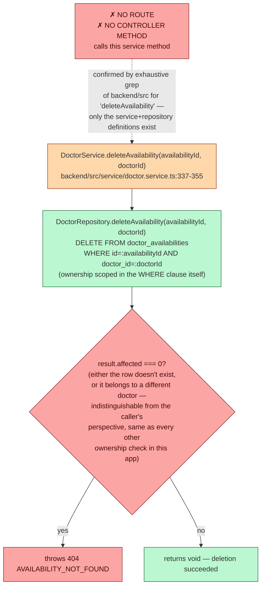
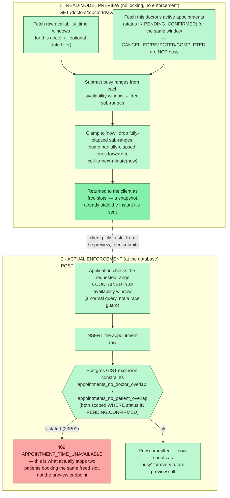

# 06 — Availability Lifecycle

`DoctorAvailability` (`backend/src/database/model/DoctorAvailability.ts`, table `doctor_availabilities`) represents one published block of time a doctor is bookable. Unlike appointments, this entity has **no status column at all** — a row either exists (available, modulo whatever's booked inside it) or it doesn't.

## Creation — `POST /doctor/availability`

Full request lifecycle diagrammed in [doc 03 §1](./03-doctor-flows.md#1-create-an-availability-window--post-doctoravailability). Summary of the checks, in order: date not in the past → start before end → (if today) start time not already passed → doctor exists (a bare 404 with no custom message — the one place in the codebase that omits one) → insert, relying entirely on a Postgres **GIST exclusion constraint** (`doctor_availability_no_overlap`, `USING GIST (doctor_id WITH =, availability_time WITH &&)`) to reject an overlapping window for the *same* doctor with a `23P01` error, translated to `409 AVAILABILITY_OVERLAP`. There is no application-level "does this overlap?" query — the database is the sole source of truth for this invariant.

Different doctors' windows may freely overlap in time (the constraint is scoped `WITH doctor_id =`, i.e. per-doctor only).

## Modification — does not exist

There is no `PATCH`/`PUT` endpoint for `DoctorAvailability` anywhere in the codebase. The only way to change a published window is to leave it as-is; a doctor who needs a different time must publish a new, non-overlapping window alongside it.

## Deletion — implemented, but unreachable

This is fully-implemented, tested-at-the-repository-level logic that the API surface simply never exposes — a doctor has **no way**, via the frontend or any documented endpoint, to remove a published availability window once created. (Confirmed independently by the frontend agent: `DoctorAvailabilitySection.tsx` calls only `createDoctorAvailabilityApi` and `getOwnDoctorAvailabilityApi` — no delete action exists in the UI, consistent with there being no route to call.)

If this is ever wired up, note the existing service method has **no check for existing appointments booked against the window being deleted** — deleting an availability row does not cascade to or block on the `appointments` that were booked inside it (appointments don't have a foreign key to `doctor_availabilities` at all, only to `doctors` directly). Wiring a delete route without adding that check would let a doctor pull the rug out from under already-confirmed appointments.

## Booking / conflict behavior

Two entirely separate mechanisms are involved, and it's important not to conflate them:

**The preview endpoint (`GET /doctors/:id/availability`) never locks or reserves anything** — it's a point-in-time read. Two patients can be shown the same free slot simultaneously; only the `POST /appointments` insert (and its underlying exclusion constraint) decides who actually wins. This exact race is exercised end-to-end by `e2e/tests/patient-booking-conflict.spec.ts`: a conflicting appointment is inserted directly into the database *between* the patient selecting a slot in the UI and submitting the booking, and the submit correctly surfaces `"Appointment time is no longer available"` without closing the modal — proving the frontend handles the 409 from the real enforcement layer, not from the (nonexistent) preview-time lock.

A cancelled appointment's time immediately becomes bookable again in the preview (verified by `doctor-availability-query.test.ts`), since cancellation just changes `status` away from `PENDING`/`CONFIRMED` — the busy-range computation re-evaluates live on every call, there is no cached/denormalized "slots remaining" counter anywhere.
