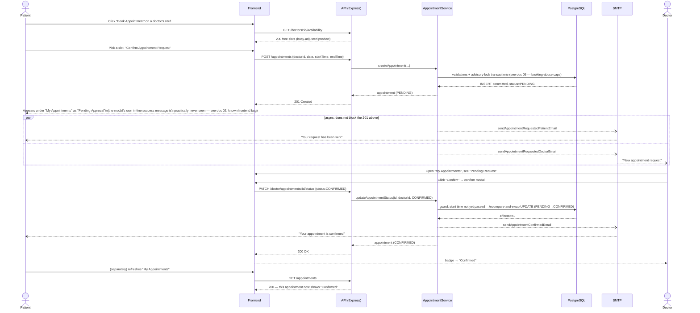
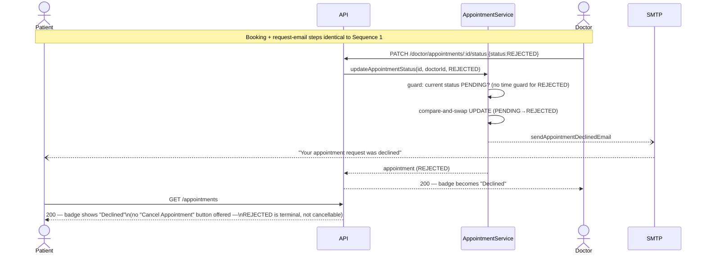
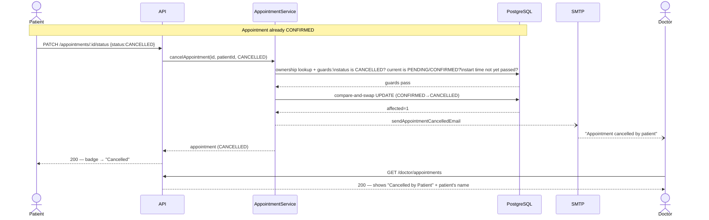
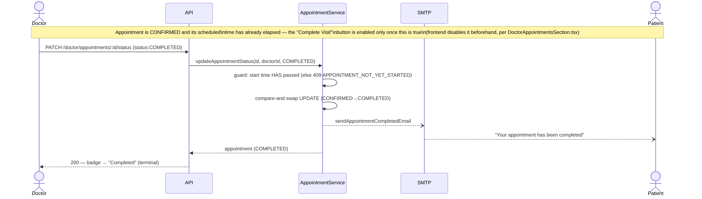
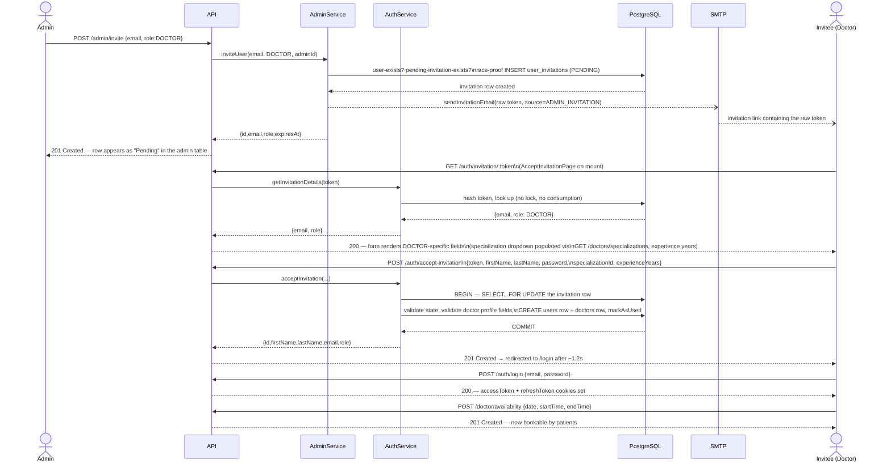

# 07 — Cross-Role Sequence Diagrams

Every diagram below is grounded in a real, passing test (integration or e2e) — cited under each one — not an idealized journey.

**Patient ↔ Admin has no direct interaction anywhere in this system.** Admin can only invite `DOCTOR`/`ADMIN` roles ([doc 04](./04-admin-flows.md)); patients exist solely via self-registration and never appear in any admin-facing screen or endpoint. No sequence diagram is drawn for it, per the instruction not to invent flows that don't exist.

## 1. Patient books, Doctor confirms

Grounded in `e2e/tests/patient-booking.spec.ts` + `e2e/tests/doctor-confirms-appointment.spec.ts` (run as two separate browser contexts, exactly as split above).

## 2. Patient books, Doctor rejects

Grounded in `e2e/tests/doctor-rejects-appointment.spec.ts`, which explicitly asserts the patient sees no cancel action on a declined appointment.

## 3. Patient cancels a confirmed appointment

Grounded in `e2e/tests/patient-cancels-appointment.spec.ts`.

## 4. Doctor completes a past appointment

Grounded in `e2e/tests/doctor-completes-past-appointment.spec.ts` (which must seed a past-dated CONFIRMED row directly in the DB, since the UI itself has no way to reach "CONFIRMED + already past" through normal booking timing in a short-lived test run).

## 5. Admin invites a Doctor → Doctor accepts → publishes availability

Grounded end-to-end in `e2e/tests/doctor-onboarding.spec.ts` (which seeds the invitation token directly rather than reading real SMTP, since — per `admin-bulk-invite.spec.ts`'s comment — this environment has no test-mode SMTP catcher and invites go out over real Gmail SMTP). The individual steps are each verified in isolation by `admin-invitations.test.ts` and `invitation.test.ts`.

**The patient-self-registration variant of step 2 onward is identical from `GET /auth/invitation/:token` onward**, except there is no Admin actor at all — the invitation's `source` is `PATIENT_SELF_REGISTRATION` and it was created by the patient themselves via `POST /auth/patient/self-register` ([doc 01](./01-authentication-authorization.md#4-post-authpatientself-register)), not by an admin action.
