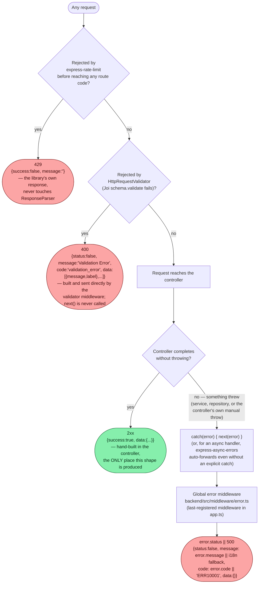
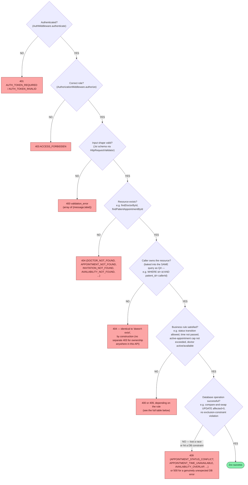

# 08 — Error & Decision Flows

## Where every response shape comes from

Three independent code paths produce a response, and none of them know about each other — this is why the envelope shape differs:

Practically: **every domain/business error in this API is a `createError.X(message)` call from the `http-errors` package**, which sets `.status` to the right code and `.message` to the string you pass — but never sets a custom `.code`, so `code` in the JSON body is essentially always the generic `"ERR10001"` fallback. `code` is not a reliable machine-readable discriminator in this API today; **`message` is the only string worth matching on**, and the frontend's own error-normalization helpers (`authApi.ts`, `profileApi.ts`) are written accordingly.

## The seven check types this API actually performs, with real examples

The user-supplied "generic" checklist, filled in with one concrete example of each from the real codebase (not hypothetical):

Not every endpoint has all seven — see docs 02/03/04 for exactly which layers apply to each one. `GET /doctors/specializations` and the health check have only Q3 (trivial) before success; `POST /appointments` has all seven, several of them twice (Q4/Q5 run for both the doctor and the patient, Q6 runs three separate times — availability, per-doctor cap, global cap).

## Complete error-constant reference

Every non-2xx business/validation constant in `backend/src/config/constant.ts`, grouped by domain, with its actual HTTP status and where it's thrown. All reach the client via the `{status:false, message, code, data}` envelope (or, for Joi failures, the `validation_error` envelope) unless noted.

### Auth & session (doc 01)

| Constant | Status | Thrown when |
|---|---|---|
| `INVALID_CREDENTIALS` | 401 | Login: no such user, or wrong password (identical message for both) |
| `AUTH_TOKEN_REQUIRED` | 401 | `authenticate`: no `accessToken` cookie |
| `AUTH_TOKEN_INVALID` | 401 | `authenticate`: JWT invalid/expired |
| `USER_NOT_AUTHENTICATED` | 401 | `authorize`: `req.user` unset (defensive; `authenticate` always runs first in practice) |
| `ACCESS_FORBIDDEN` | 403 | `authorize`: role not in the allowed list |
| `INVALID_REFRESH_TOKEN` | 401 | `/auth/refresh`: cookie missing, malformed token, or user gone |
| `REFRESH_TOKEN_EXPIRED` | 401 | `/auth/refresh`: `jwt.TokenExpiredError` |
| `INVALID_INVITATION` | 400 | Invitation not found by hashed token |
| `INVITATION_ALREADY_USED` | 400 | Accept/preview: `usedAt` already set |
| `INVITATION_REVOKED` | 400 | Accept/preview: `revokedAt` already set |
| `INVITATION_EXPIRED` | 400 | Accept/preview: `expiresAt <= now` |
| `SPECIALIZATION_ID_REQUIRED` / `EXPERIENCE_YEARS_REQUIRED` / `INVALID_SPECIALIZATION` | 400 | Accept-invitation, role=DOCTOR, missing/invalid profile field |
| `DOB_REQUIRED` / `INVALID_DOB` / `HEIGHT_REQUIRED` / `INVALID_HEIGHT` / `WEIGHT_REQUIRED` / `INVALID_WEIGHT` / `BLOOD_GROUP_REQUIRED` / `INVALID_BLOOD_GROUP` | 400 | Accept-invitation, role=PATIENT, missing/invalid profile field |

### Admin & invitations (doc 04)

| Constant | Status | Thrown when |
|---|---|---|
| `USER_ALREADY_EXISTS` | 409 | Invite: email already has an account |
| `INVITATION_ALREADY_SENT` | 409 | Invite / self-register: an active invitation already exists for this email |
| `CSV_FILE_REQUIRED` | 400 | Bulk invite: no file attached |
| `CSV_ROW_LIMIT_EXCEEDED` | 400 | Bulk invite: > 500 rows |
| `FAILED_TO_SEND_INVITATION` | 500 | Invite: email delivery threw (invitation row is compensating-deleted first) |
| `INVITATION_NOT_FOUND` | 404 | Revoke: no such invitation id |
| `INVITATION_ALREADY_REVOKED` | 409 | Revoke: already revoked |
| `CANNOT_REVOKE_USED_INVITATION` | 400 | Revoke: `usedAt` already set |
| `INVALID_ROW_DATA` / `DUPLICATE_EMAIL_IN_FILE` | n/a (per-row) | Bulk invite: never an HTTP error — the overall request is still `200`; these are per-row `"reason"` strings inside `data.results[]` |

### Doctor & availability (doc 03, 06)

| Constant | Status | Thrown when |
|---|---|---|
| `DOCTOR_NOT_FOUND` | 404 | Any lookup by doctor id that finds nothing |
| `AVAILABILITY_DATE_IN_PAST` / `AVAILABILITY_TIME_IN_PAST` / `INVALID_AVAILABILITY_TIME` | 400 | Create availability: date/time validation |
| `AVAILABILITY_OVERLAP` | 409 | Create availability: GIST exclusion constraint hit (`23P01`) |
| `AVAILABILITY_NOT_FOUND` | 404 | `deleteAvailability` (unreachable via any route today — see doc 06) |

### Patient (doc 02)

| Constant | Status | Thrown when |
|---|---|---|
| `PATIENT_NOT_FOUND` | 404 | Any lookup by patient id that finds nothing |

### Appointments (doc 05)

| Constant | Status | Thrown when |
|---|---|---|
| `APPOINTMENT_NOT_FOUND` | 404 | Ownership-scoped lookup finds nothing (doesn't exist, or belongs to someone else) |
| `APPOINTMENT_DATE_IN_PAST` / `APPOINTMENT_TIME_IN_PAST` / `INVALID_APPOINTMENT_TIME` | 400 | Create: date/time validation |
| `DOCTOR_NOT_AVAILABLE` | 409 | Create: requested range not covered by any availability window |
| `APPOINTMENT_TIME_UNAVAILABLE` | 409 | Create: GIST exclusion constraint hit (`23P01`) — the real double-booking guard |
| `MAX_ACTIVE_APPOINTMENTS_PER_DOCTOR_EXCEEDED` | 409 | Create: patient already has 2 active appointments with this doctor |
| `MAX_ACTIVE_APPOINTMENTS_TOTAL_EXCEEDED` | 409 | Create: patient already has 5 active appointments total |
| `INVALID_STATUS_TRANSITION` | 400 | Any disallowed status transition (from either the doctor or patient endpoint) |
| `PATIENT_CAN_ONLY_CANCEL` | 400 | Patient endpoint: requested status isn't literally `CANCELLED` (redundant with Joi, checked again) |
| `APPOINTMENT_TIME_ALREADY_PASSED` | 409 | Doctor confirms a `PENDING` appointment whose start time already passed |
| `APPOINTMENT_NOT_YET_STARTED` | 409 | Doctor completes a `CONFIRMED` appointment before its start time |
| `CANNOT_CANCEL_PAST_APPOINTMENT` | 409 | Patient cancels an appointment whose start time already passed |
| `APPOINTMENT_STATUS_CONFLICT` | 409 | Compare-and-swap update lost a race — another request changed the row first |
| `INVALID_DATE_FILTER` / `INVALID_DATE_RANGE` | 400 | Listing endpoints: conflicting or malformed date-range query params |

## Rate-limit map (doc 01, repeated here for completeness)

| Limiter | Max / 15 min | Routes |
|---|---|---|
| `general` | 1000 | Everything not listed below |
| `auth` | 300 | All 6 `/auth/*` routes except self-register |
| `invitation` | 500 | `/admin/invite`, `/admin/invitations/bulk` |
| `patientSelfRegistration` | 10 | `/auth/patient/self-register` only |

All four are IP-keyed, disabled entirely when `NODE_ENV=test`, and return `429 {success:false, message:"<limiter message>"}` — bypassing every other response mechanism in the app.
